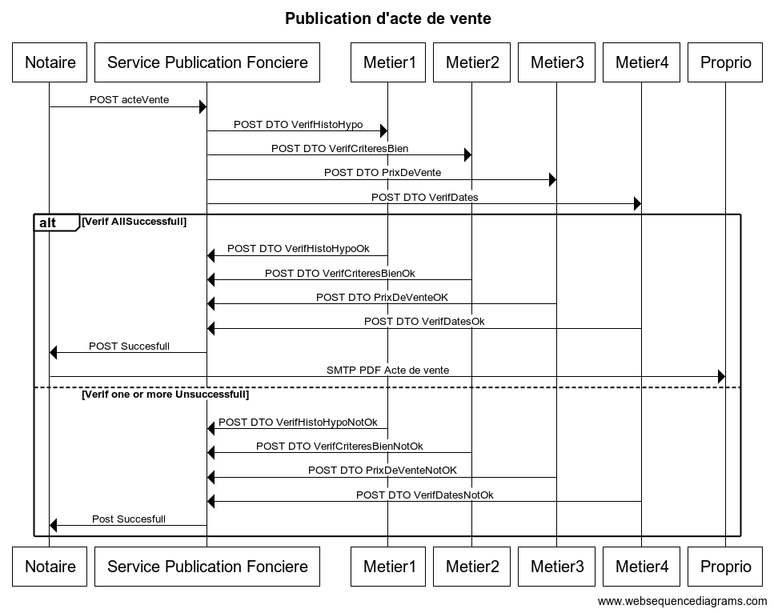

## Objectifs du système à modéliser

On propose de modéliser un système de 

## Interfaces

```
title Publication d'acte de vente


Notaire->Service Publication Fonciere: POST acteVente


Service Publication Fonciere->Metier1: POST DTO VerifHistoHypo
Service Publication Fonciere->Metier2: POST DTO VerifCriteresBien
Service Publication Fonciere->Metier3: POST DTO PrixDeVente
Service Publication Fonciere->Metier4: POST DTO VerifDates


alt Verif AllSuccessfull
    Metier1->Service Publication Fonciere: POST DTO VerifHistoHypoOk
    Metier2->Service Publication Fonciere: POST DTO VerifCriteresBienOk
    Metier3->Service Publication Fonciere: POST DTO PrixDeVenteOK
    Metier4->Service Publication Fonciere: POST DTO VerifDatesOk
    Service Publication Fonciere->Notaire: POST Succesfull
    Notaire->Proprio: SMTP PDF Acte de vente
    
else Verif one or more Unsuccessfull
    Metier1->Service Publication Fonciere: POST DTO VerifHistoHypoNotOk
    Metier2->Service Publication Fonciere: POST DTO VerifCriteresBienNotOk
    Metier3->Service Publication Fonciere: POST DTO PrixDeVenteNotOK
    Metier4->Service Publication Fonciere: POST DTO VerifDatesNotOk
    Service Publication Fonciere->Notaire: Post Succesfull
end
```


## Schéma relationnel


## Exigences fonctionnelles

* le vendor NE DOIT proposer que les concerts pour lesquels il a un quota disponible, transmis par le master.
* le vendor DOIT pouvoir effectuer les opérations de booking et ticketing
* le master DOIT permettre à l'artiste d'annuler son concert.
* le master DOIT informer le vendor en cas d'annulation de concert
* le vendor DOIT informer les clients de l'annulation du concert par mail
* le master DOIT proposer un service de validation de la clé du ticket, pour les contrôles aux entées.

## Exigences non fonctionnelles

* le booking et le ticketing, bien qu'étant des opérations synchrones, DOIVENT être fiables et donc utiliser le messaging
* Lors de l'annulation de tickets, le master DOIT informer tous les vendors de l'annulation, de façon fiable.
© 2021 GitHub, Inc.
Terms
Privacy
Security
Status
Docs
Contact GitHub
Pricing
API
Training
Blog
About
