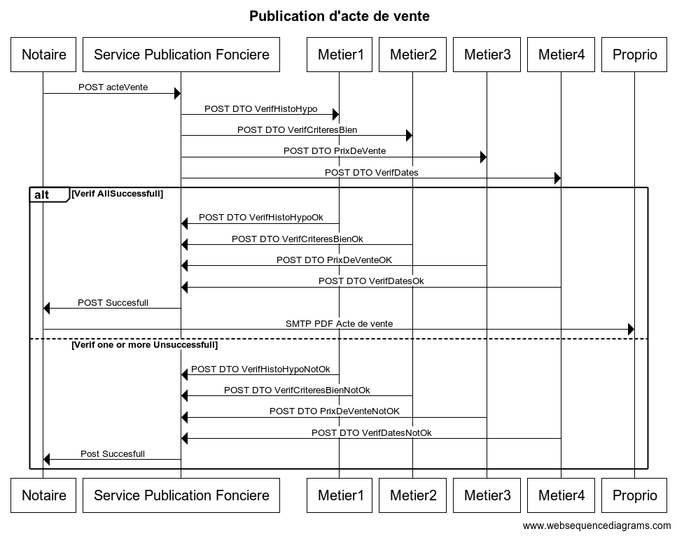

## Objectifs du système à modéliser

On propose de modéliser un système de vérification d'acte de vente à travers le service de publication fonciére, afin de vérifier plusieurs conditions : 

- Vérification de la liste des anciens et actuel propriétaires du bien.
- Vérifications des critères du bien (superficie, concordance des données,...) <- A compléter 
- Vérifier que le prix de vente est compris dans la fourchette des prix des autres biens présents dans le même quartier 
- Vérifier de la concordance des dates <- A compléter  

## Interfaces

```
title Publication d'acte de vente


Notaire->Service Publication Fonciere: POST acteVente


Service Publication Fonciere->Metier1: POST DTO VerifHistoHypo
Service Publication Fonciere->Metier2: POST DTO VerifCriteresBien
Service Publication Fonciere->Metier3: POST DTO PrixDeVente
Service Publication Fonciere->Metier4: POST DTO VerifDates


alt Verif AllSuccessfull
    Metier1->Service Publication Fonciere: POST DTO VerifHistoHypoOk
    Metier2->Service Publication Fonciere: POST DTO VerifCriteresBienOk
    Metier3->Service Publication Fonciere: POST DTO PrixDeVenteOK
    Metier4->Service Publication Fonciere: POST DTO VerifDatesOk
    Service Publication Fonciere->Notaire: POST Succesfull
    Notaire->Proprio: SMTP PDF Acte de vente
    
else Verif one or more Unsuccessfull
    Metier1->Service Publication Fonciere: POST DTO VerifHistoHypoNotOk
    Metier2->Service Publication Fonciere: POST DTO VerifCriteresBienNotOk
    Metier3->Service Publication Fonciere: POST DTO PrixDeVenteNotOK
    Metier4->Service Publication Fonciere: POST DTO VerifDatesNotOk
    Service Publication Fonciere->Notaire: Post Succesfull
end
```


## Schéma relationnel


## Exigences fonctionnelles

* Le service de publicité foncière DOIT vérifier l'acte de vente, en déléguant les différentes parties de ce dernier à différents services.
* Le vendeur d’un bien DOIT être le propriétaire de ce dernier.
* Un bien NE DOIT PAS être hypothéqué.
* Le diagnostic d'amiante DOIT être précisé dans l’acte de vente.
* Un bien NE DOIT PAS pouvoir être chauffé au gaz si le bien est neuf.
* Le prix d’un bien NE DOIT PAS être inférieur au prix de vente le plus bas d’une zone géographique déterminée par un code postal.
* le vendeur et l'acheteur DOIVENT fixer une date de signature pour le compromis de vente.
* le vendeur NE DOIT PAS renoncer à la vente ou proposer le bien immobilier à un tiers acquéreur pendant la promesse de vente.
* la signature de l'acte de vente chez le notaire DOIT avoir lieu dans les délais dans le compromis de vente. (2 mois minimum)
* le notaire DOIT pouvoir repousser la date de signature de manière unilatérale (si contraintes administratives).
* Le futur acquéreur DOIT pouvoir renoncer à l'achat pendant les dix jours qui suivent la signature d'un compromis de vente.
* Si le retractaire a versé un dépôt de grantie auprès du notaire, il DOIT restituer la somme dans les 21 jours suivants.
* Le notaire DOIT transmettre le titre de propriété au propriétaire si le service de publicité foncière valide l'acte de vente.
* Le titre de propriété DOIT être transmis par mail en version pdf au propriétaire.

## Exigences non fonctionnelles

* le notaire DOIT remettre à l'acheteur une attestation immobilière de propriété en attendant la transmission du titre de propriété. (pendant le temps d'obtention de titre de proprio qui généralement se fait en 6 mois)
