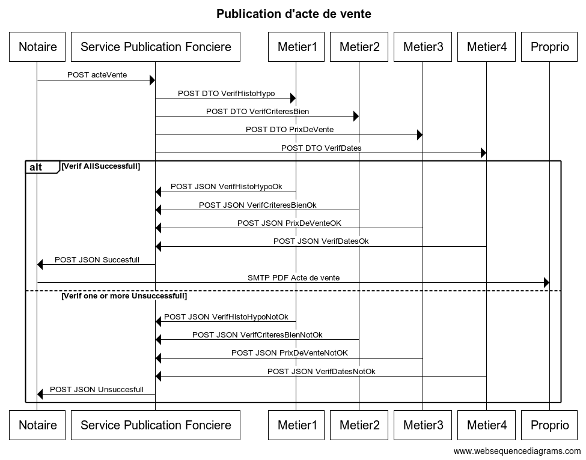
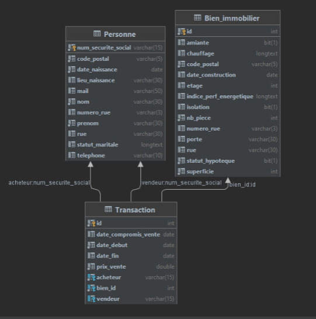

## Objectifs du système à modéliser

On propose de modéliser un système de vérification d'acte de vente à travers le service de publication fonciére, afin de vérifier plusieurs conditions : 

- Vérification de la liste des anciens et actuel propriétaires du bien.
- Vérifications des critères du bien (superficie, amiante, isolation, date de construction, chauffage, indice de performance énergétique) 
- Vérifier que le prix de vente est compris dans la fourchette des prix des autres biens présents dans le même quartier 
- Vérifier de la concordance des dates, la date de signature de l'acte de vente doit être supérieur à deux mois de la date du compromis de vente  

## Interfaces

```
title Publication d'acte de vente


Notaire->Service Publication Fonciere: POST acteVente


Service Publication Fonciere->Metier1: POST DTO VerifHistoHypo
Service Publication Fonciere->Metier2: POST DTO VerifCriteresBien
Service Publication Fonciere->Metier3: POST DTO PrixDeVente
Service Publication Fonciere->Metier4: POST DTO VerifDates


alt Verif AllSuccessfull
    Metier1->Service Publication Fonciere: POST JSON VerifHistoHypoOk
    Metier2->Service Publication Fonciere: POST JSON VerifCriteresBienOk
    Metier3->Service Publication Fonciere: POST JSON PrixDeVenteOK
    Metier4->Service Publication Fonciere: POST JSON VerifDatesOk
    Service Publication Fonciere->Notaire: POST JSON Success
    Notaire->Proprio: SMTP PDF Acte de vente
    
else Verif one or more Unsuccessfull
    Metier1->Service Publication Fonciere: POST JSON VerifHistoHypoNotOk
    Metier2->Service Publication Fonciere: POST JSON VerifCriteresBienNotOk
    Metier3->Service Publication Fonciere: POST JSON PrixDeVenteNotOK
    Metier4->Service Publication Fonciere: POST JSON VerifDatesNotOk
    Service Publication Fonciere->Notaire: POST JSON Unsuccess
end

```


## Schéma relationnel



## Exigences fonctionnelles

* Le service de publicité foncière DOIT vérifier l'acte de vente, en déléguant les différentes parties de ce dernier à différents services.
* Un bien NE DOIT PAS être hypothéqué.
* Un acte DOIT comporter tous les anciens propriétaires.
* Le diagnostic d'amiante DOIT être précisé dans l’acte de vente.
* Un bien NE DOIT PAS pouvoir être chauffé au gaz.
* Le prix d’un bien NE DOIT PAS être inférieur au prix de vente le plus bas d’une zone géographique déterminée par un code postal.
* le vendeur et l'acheteur DOIVENT fixer une date de signature pour le compromis de vente.
* la signature de l'acte de vente chez le notaire DOIT avoir lieu dans les délais dans le compromis de vente. (2 mois minimum)
* Le notaire DOIT transmettre le titre de propriété au propriétaire si le service de publicité foncière valide l'acte de vente.
* Le titre de propriété DOIT être transmis par mail en version pdf au propriétaire.


